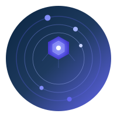

<div align="center">

# ◈ Orium

### **The Foundational Element of Intelligence**

<p align="center">
  
  
  
  
  
</p>

<p align="center">
  <b>Universal AI Infrastructure</b> — One gateway, every model, every device.
</p>

<p align="center">
  <a href="#-quick-start">🚀 Quick Start</a> ·
  <a href="#-features">✨ Features</a> ·
  <a href="#-adapters">🔌 Adapters</a> ·
  <a href="#-architecture">🏗️ Architecture</a> ·
  <a href="#-documentation">📖 Docs</a>
</p>



</div>

---

## 🎯 What is Orium?

Orium is a **unified, open-source AI infrastructure** that combines four powerful capabilities into one cohesive system:

| Capability | Description |
|-----------|-------------|
| 🤖 **Agent Orchestration** | Multi-agent collaboration with memory, tools, and workflow execution |
| 🌐 **Universal Protocol Gateway** | 57+ model adapters, unified API, intelligent routing |
| 🛠️ **Application Development Platform** | Skills, RAG, batch processing, knowledge bases |
| ⚡ **AI-Native Runtime** | Edge-ready, cross-platform, production-grade |

> Built for **every device**, **every user**, **every model**.

---

## 🚀 Quick Start

### One-Line Install

```bash
curl -fsSL https://orium.dev/install | sh
```

### Or Clone & Run

```bash
git clone https://github.com/Kitaro-Loked/orium.git
cd orium
npm install
npm run build
npm start
```

### Interactive Setup

```bash
# Recommended first-time setup
npx orium onboard

# Or use the wizard
npx orium init
```

### Start Chatting

```bash
# CLI chat
npx orium chat

# Start Web UI + API server
npx orium serve

# Open http://localhost:3000/ui/v3/ for the web interface
```

---

## ✨ Features

### 🔌 57+ Model Adapters
Connect to virtually any AI provider with a single unified interface:

**Cloud Providers:** OpenAI · Claude · Gemini · Azure · DeepSeek · Groq · Together · Mistral · Cohere · Perplexity · AI21 · Replicate · Fireworks · Novita · SiliconFlow · and more

**Chinese Models:** Qwen · Zhipu · Moonshot · Baichuan · MiniMax · StepFun · Xunfei · Baidu · Doubao · Hunyuan · Lingyiwanwu

**Enterprise & Cloud:** AWS Bedrock · Cloudflare · Vertex · Watsonx · Nvidia · SambaNova · Cerebras · Lambda · Chutes · PPIO · VolcEngine

**IDE Integrations:** GitHub Copilot · Cursor · Windsurf · Codeium · Continue · Aider · JetBrains

**Local & Self-Hosted:** Ollama · LM Studio · vLLM · SGLang · llama.cpp · TabbyAPI

**Relay & Proxy:** API2D · OhMyGPT · AIProxy · CloseAI · OneAPI · NewAPI · and more

### 🧠 Multi-Agent System
- **Sequential**, **Hierarchical**, and **Parallel** collaboration modes
- Working memory (7 items) · Short-term memory (100 items) · Long-term memory
- Agent groups inspired by CrewAI

### 🛠️ Tool Calling & Skills
- **Tavily** — Deep research & web search
- **Serper** — Google Search API
- **Alpha Vantage** — Global stock & crypto data
- **EastMoney** — China A-share market data
- **Firecrawl** — Web scraping & extraction
- **Nobana** — Knowledge base platform
- MCP-compatible tool registry

### 🎨 Beautiful Web UI
- **Liquid Glass** design inspired by Apple
- Dark & light themes
- Real-time streaming with syntax highlighting
- Code copy buttons, image preview, file upload
- Command palette (Ctrl+K), slash commands
- Mobile-responsive

### ⚡ Production-Ready
- **Smart Router** — Cost-based, latency-based, round-robin, random strategies
- **Token Pool** — Multi-key rotation with rate limit handling
- **Concurrency Control** — Per-adapter semaphore limiting
- **Failover** — Automatic retry with adapter fallback
- **Batch Processing** — Async job queue
- **WebSocket** — Real-time streaming chat

---

## 🔌 Supported Adapters

<details>
<summary><b>Click to expand full adapter list (57+)</b></summary>

| Category | Adapters |
|----------|----------|
| **OpenAI-Compatible** | OpenAI, Azure, DeepSeek, Groq, Together, Fireworks, Novita, SiliconFlow, Lambda, Hyperbolic, PPIO, VolcEngine |
| **Anthropic** | Claude (Anthropic), Claude (Bedrock), Claude (Vertex) |
| **Google** | Gemini, Vertex |
| **Chinese** | Qwen, Zhipu, Moonshot, Baichuan, MiniMax, StepFun, Xunfei, Baidu, Doubao, Hunyuan, Lingyiwanwu |
| **Local** | Ollama, LM Studio, vLLM, SGLang, llama.cpp |
| **IDE** | GitHub Copilot, Cursor, Windsurf, Codeium, Continue, Aider, JetBrains |
| **Enterprise** | AWS Bedrock, Cloudflare, Watsonx, Nvidia, SambaNova, Cerebras, Chutes |
| **Relay** | API2D, OhMyGPT, AIProxy, CloseAI, OneAPI, NewAPI, VOAPI, AIHub, GPTAPI, OpenAISB, AIKEY, GOAPI, APIGPT |
| **Free** | Pollinations, DuckDuckGo, Blackbox, HuggingFace |
| **Reverse** | Poe, ChatGPT, Claude, Bing Copilot |

</details>

---

## 🏗️ Architecture

```
┌─────────────────────────────────────────────────────────────────┐
│                         UI Layer                                 │
│   ┌─────────┐ ┌─────────┐ ┌─────────┐ ┌─────────┐ ┌─────────┐  │
│   │  Web    │ │  CLI    │ │ Desktop │ │ Mobile  │ │ Headless│  │
│   │  /ui/v3 │ │  REPL   │ │  (TBD)  │ │  (TBD)  │ │  API    │  │
│   └─────────┘ └─────────┘ └─────────┘ └─────────┘ └─────────┘  │
├─────────────────────────────────────────────────────────────────┤
│                      Core Engine                                 │
│   ┌─────────────┐ ┌─────────────┐ ┌─────────────┐              │
│   │ Orchestrator│ │   Router    │ │    Batch    │              │
│   │  (Agents)   │ │ (Strategy)  │ │  Processor  │              │
│   └─────────────┘ └─────────────┘ └─────────────┘              │
│   ┌─────────────┐ ┌─────────────┐ ┌─────────────┐              │
│   │   Memory    │ │   Tools     │ │  Workflow   │              │
│   │  (3-tier)   │ │  (MCP)      │ │   Engine    │              │
│   └─────────────┘ └─────────────┘ └─────────────┘              │
├─────────────────────────────────────────────────────────────────┤
│                     Adapter Layer                                │
│   ┌─────────┐ ┌─────────┐ ┌─────────┐ ┌─────────┐ ┌─────────┐  │
│   │ OpenAI  │ │ Claude  │ │ Gemini  │ │ Ollama  │ │ Custom  │  │
│   │  (57+)  │ │         │ │         │ │         │ │         │  │
│   └─────────┘ └─────────┘ └─────────┘ └─────────┘ └─────────┘  │
├─────────────────────────────────────────────────────────────────┤
│                     Runtime Layer                                │
│   Node.js · Bun · Deno · Browser · Edge · Web Worker           │
└─────────────────────────────────────────────────────────────────┘
```

---

## 📖 Documentation

| Document | Description |
|----------|-------------|
| [ARCHITECTURE.md](docs/ARCHITECTURE.md) | System design & component overview |
| [ADAPTERS.md](docs/ADAPTERS.md) | Adapter development guide |
| [ROADMAP.md](docs/ROADMAP.md) | Future plans & milestones |

---

## 🛠️ Development

```bash
# Install dependencies
npm install

# Development mode (watch)
npm run dev

# Build
npm run build

# Run tests
npm test

# Lint
npm run lint

# Format
npm run format
```

---

## 🤝 Contributing

We welcome contributions! Please see our [Contributing Guide](CONTRIBUTING.md) for details.

```bash
# Fork and clone
git clone https://github.com/your-username/orium.git
cd orium

# Create a branch
git checkout -b feature/your-feature

# Make changes and commit
git add .
git commit -m "feat: add your feature"

# Push and create PR
git push origin feature/your-feature
```

---

## 📜 License

MIT © [Orium Contributors](LICENSE)

---

<div align="center">

**[⭐ Star us on GitHub](https://github.com/Kitaro-Loked/orium)** · **[🐛 Report Bug](https://github.com/Kitaro-Loked/orium/issues)** · **[💡 Request Feature](https://github.com/Kitaro-Loked/orium/issues)**

<p align="center">
  <sub>Built with ❤️ by the Orium community</sub>
</p>

</div>
